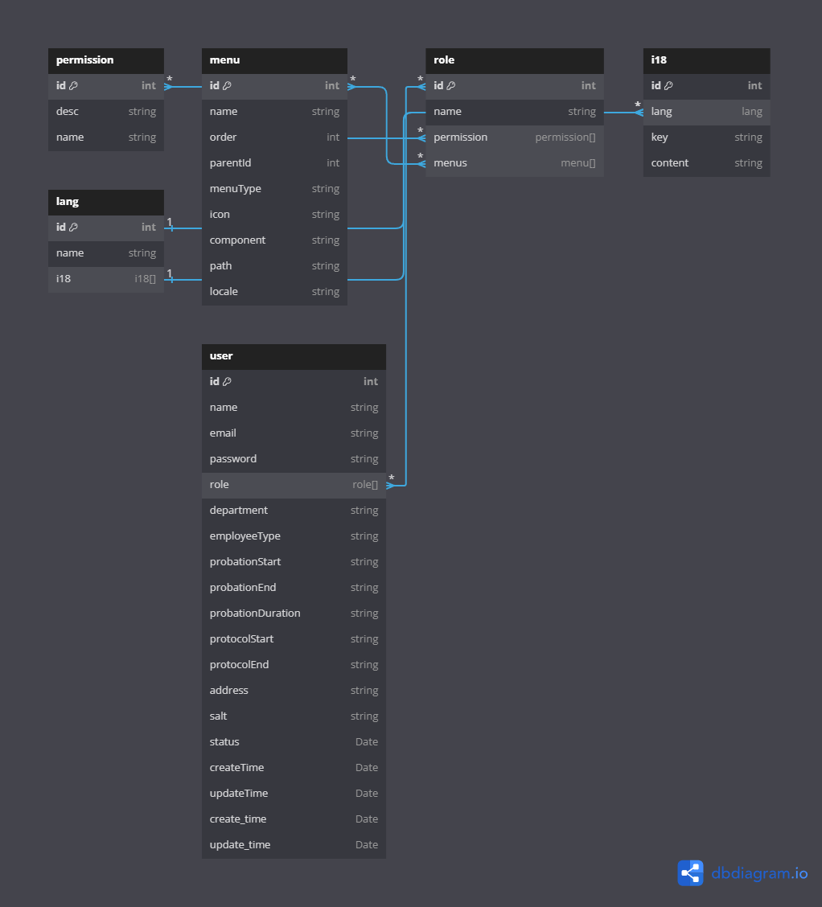
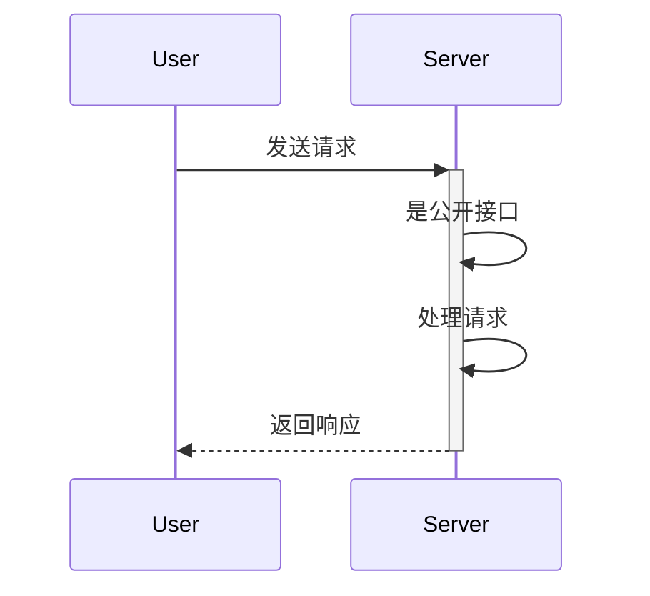
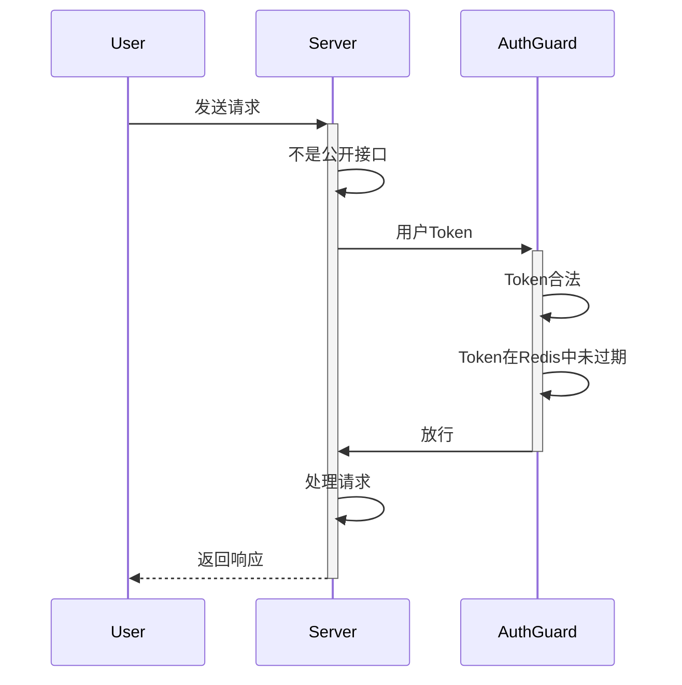
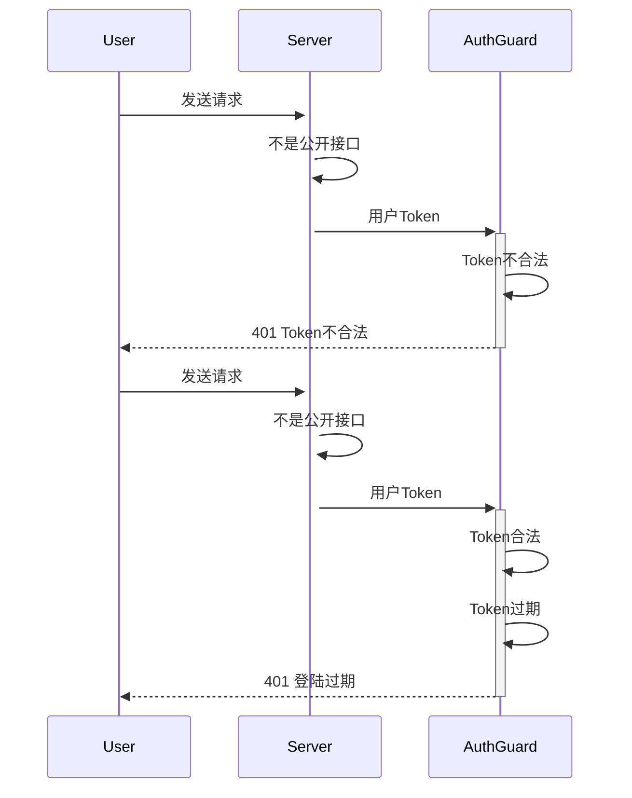
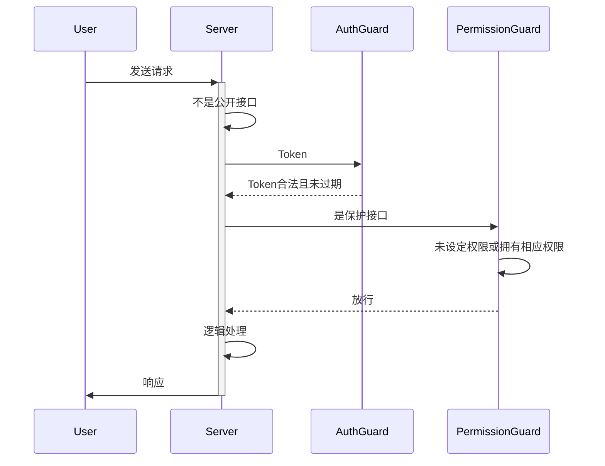
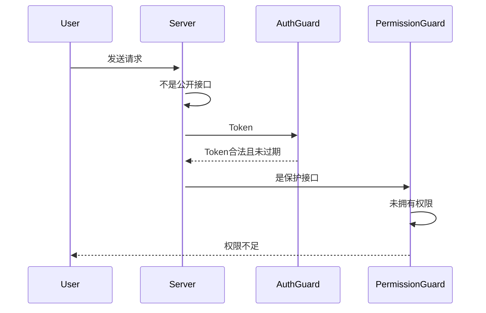

# TinyPro 后端设计架构

本文档旨在捋清 TinyPro 后端设计架构。

## 表设计

## 专用术语

- 公开接口: 一个不需要Token的接口, 一般是登录接口.
- 非公开接口: 一个需要Token的接口, 当Token过期时必须返回401响应码. 错误报文格式请参考[异常格式](#异常格式)
- 保护接口: 一个需要相应权限的接口, 会从Token中读取用户Email, 如果Token过期则**必须**返回401响应码，如果用户**没有**相应的权限，**必须**返回一个403响应码，错误报文格式请参考[异常格式](#异常格式)

## 请求示意图

### 公开接口请求示意图

### 非公开接口请求示意图

#### 正常响应

如果用户Token合法且未过期则不会返回异常

#### 异常响应

如果Token过期或异常则会返回异常响应

### 保护接口

#### 正常响应

#### 异常响应

