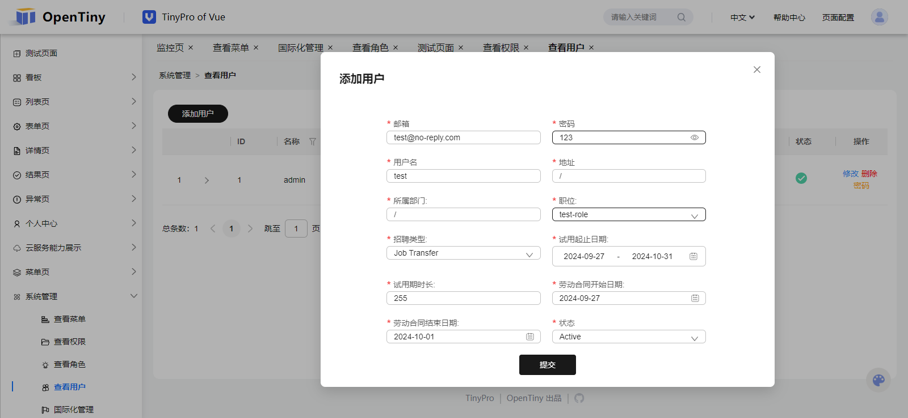

# TinyPro 前端开发指南

在阅读本文时，我们假设您已经学习过了Vue3. 在开始二次开发前, 我们需要先启动`tiny-pro`后端. 请参阅[TinyPro 快速上手](./tiny-pro.md)

## 页面开发

### 第一步、新建页面

首先我们在`tiny-pro/web/src/views`下新建一个`test-page`目录, 该目录下只有一个`index.vue`文件。目录结构如下图所示

```
web
  src
    views
      test-page
        index.vue
```

```html
<!-- index.vue -->
<template>
    <p>hello world</p>
</template>
```

### 第二步、创建国际化词条

点击 `系统管理 > 国际化管理` 打开国际化管理页面。在 `系统管理 > 国际化管理` 页面中单击 `增加词条` 按钮。弹出modal应如下所示


在该modal中，我们将词条Key定义为了`test::page::title`, 词条内容为 `测试页面`。 点击 `词条语言` 下的下拉框，选择`zhCN`(简体中文)


选择好语言后单击 `添加词条` 按钮即可成功将Key 为 `test::page::title` 的简体中文国际化词条添加到数据库中。

### 第三步、绑定菜单

点击`系统管理 > 查看菜单`打开菜单管理页面, 在 `系统管理 > 查看菜单` 中点击 `添加菜单`


- 名称
  - 这里一般为英文, 在开发的时候对应的是该路由的id
- 优先级
  - 在菜单中排列的优先级，优先级越高越靠近上方(浏览器顶部)
- 父级菜单
  - 如果设置了父级菜单，则会作为父级菜单的子集
- 图标
  - 菜单中的图标，必选
- 组件
  - 组件名称，在该实例中是`test-page/index.vue`。填写该表单项的时候不能包含`src/views`前缀!
- 国际化
  - 菜单的国际化文本

点击 `确认` 按钮后, `Modal`会自动关闭。


点击 `系统管理 > 查看角色` 来到角色管理页面

点击`绑定菜单`按钮，本实例将菜单绑定到了`admin`用户。勾选`测试页面`后，单击`确认修改`按钮(右下角)后，在左侧菜单便会出现测试页面菜单项


### 第四步、正式开发

现在单击 `测试页面` 菜单项会发现只有一个银色的 `hello-world` 字样。接下来我们进入正式开发阶段。

我们将在页面中添加一个一级标题，一个按钮，与**两行**文本，点击按钮后，第一行文本自增，第二行文本会在自增的基础上*2. 请将`tiny-pro/web/src/views/test-page/index.vue`替换为如下代码

```html
<script lang="ts" setup>
import GeneralLayout from '@/layout/general-layout.vue';
import {Button as TinyButton} from '@opentiny/vue';
import { useUserStore } from '@/store';
import {ref, computed} from 'vue';

const count = ref(0);
const incr = () => {
    count.value +=1;
}
const double = computed(() => count.value * 2);
const userStore = useUserStore();
const userName = computed(() => userStore.name);
</script>

<template>
    <general-layout :breadcrumb="['test::page::title']">
        <h1> Hi {{ userName }} !</h1>
        <tiny-button @click="incr">
            Click me
        </tiny-button>
        <p>Count: {{ count }}</p>
        <p>Count * 2 = {{ double }}</p>
    </general-layout>
</template>
```

最终效果如下


## 权限管理

本章将会进行组件级别的权限管理。我们依然沿用上一章的测试页面。这一章我们将创建一个`test-role`角色，绑定给一个`test`用户。并且在测试页面中，为`Count * 2`这个元素增加一个`test::page::double::text`权限，并且我们并不给`test-role`用户绑定该权限。

### 新增权限

请点击 `系统管理 > 查看权限` 来到权限管理页面。在 `系统管理 > 查看权限` 页面中单击 `添加权限` 按钮。并按照图示填写信息


单击 `确认` 按钮后上方会出现 `表单提交成功` 字样。表明权限已经成功添加到了数据库中。接下里我们需要新增角色

### 新增角色


点击 `系统管理 > 查看角色` 来到角色管理页面。在角色管理页面中点击 `添加角色` 按钮。并按照图示填写信息


注意！一定不要拥有**test::page::double::text**权限！！

点击 `确认` 后, 弹出框将会自动关闭. 接下来我们需要创建用户

### 新增用户

点击 `系统管理 > 查看用户`来到用户管理页面。在用户管理页面中点击 `添加用户` 按钮。并按照图示填写信息



之后我们需要为`test-role`角色来绑定菜单，我们可以只绑定一个`测试页面`菜单


### 修改页面

现在我们来到`tiny-pro/web/src/views/test-page/index.vue`中，将文件中的代码替换为如下代码

```html
<script lang="ts" setup>
import GeneralLayout from '@/layout/general-layout.vue';
import {Button as TinyButton} from '@opentiny/vue';
import { useUserStore } from '@/store';
import {ref, computed} from 'vue';

const count = ref(0);
const incr = () => {
    count.value +=1;
}
const double = computed(() => count.value * 2);
const userStore = useUserStore();
const userName = computed(() => userStore.name);
</script>

<template>
    <general-layout :breadcrumb="['test::page::title']">
        <h1> Hi {{ userName }} !</h1>
        <tiny-button @click="incr">
            Click me
        </tiny-button>
        <p>Count: {{ count }}</p>
        <p v-permission="'test::page::double::text'">Count * 2 = {{ double }}</p>
    </general-layout>
</template>
```

### 登陆测试用户

点击提交后，弹窗将会自动关闭。现在将鼠标放到右上角头像上，在弹出框中选择 `退出登录`。按照下图是输入信息


因为我们只给`test-role`绑定了一个`测试页面`的路由，所以会跳转到测试页面，可以发现原本要出现的`Count * 2`如今已经不存在了。


## 遇到困难?

加官方小助手微信 opentiny-official，加入技术交流群

## 常见问题

### 前端跨域问题如何解决

对于开发环境来说，可以直接修改`dev-server`的`proxy`. 例如`vite`工具的`server.proxy`

### 代码无法提交

您可以选择移除husky或根据[Angular 规范](https://zj-git-guide.readthedocs.io/zh-cn/latest/message/Angular%E6%8F%90%E4%BA%A4%E4%BF%A1%E6%81%AF%E8%A7%84%E8%8C%83/)书写commit信息

### 页面部署后刷新404

请移步[Vue Router服务器部署指南](https://router.vuejs.org/guide/essentials/history-mode.html#Example-Server-Configurations)
